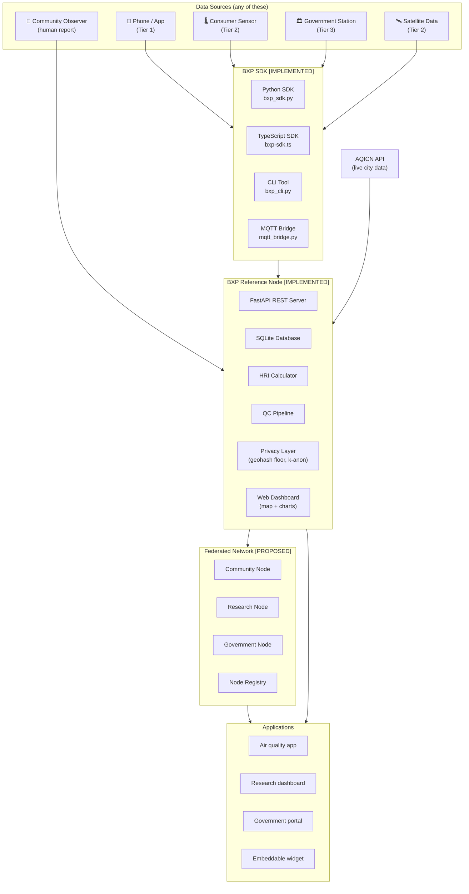
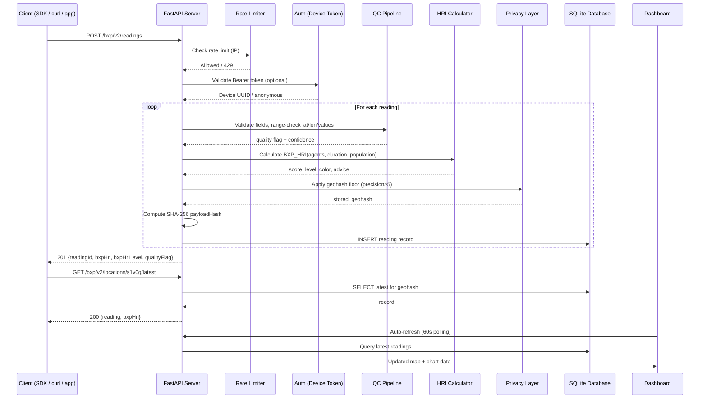
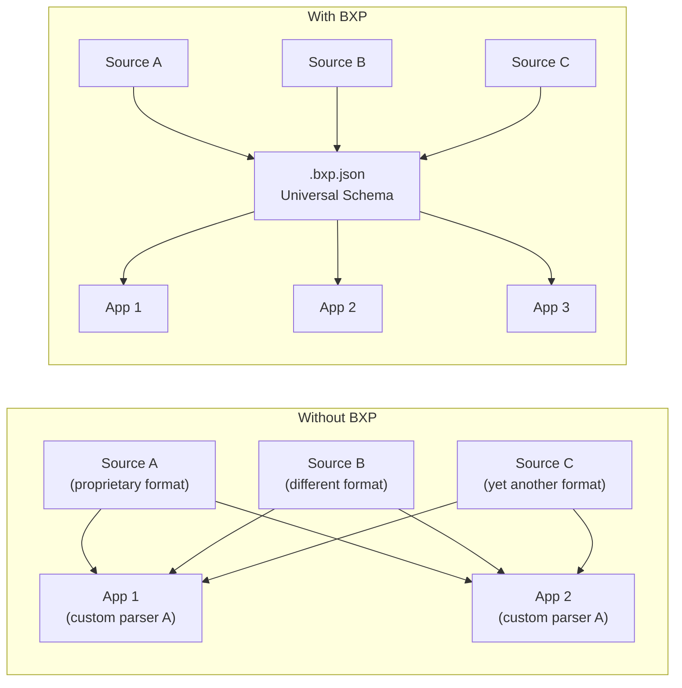
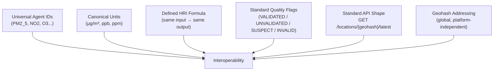
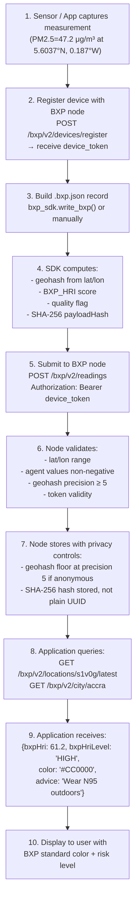
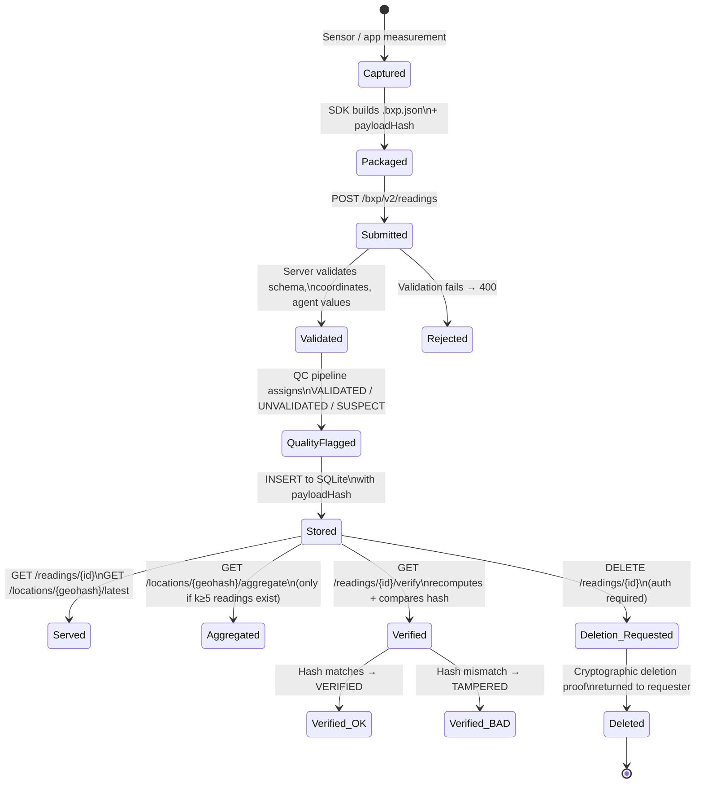
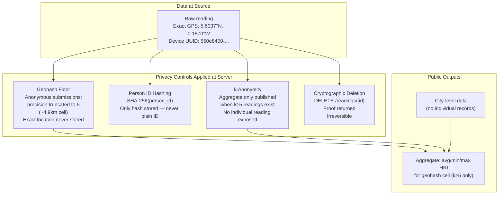

# BXP System Architecture

**Author:** Elvarin  
**Version:** BXP v2.0 / Reference Server v2.1  
**Date:** 2026

---

## Overview

This document describes the architecture of the Breathe Exposure Protocol (BXP) at four levels:
1. High-level ecosystem
2. Data flow through a BXP node
3. Interoperability model
4. Data lifecycle

For each diagram, the implementation status is noted: whether the component is built, specified, or proposed.

---

## Architecture 1 — High-Level BXP Ecosystem

**What this represents:** The full BXP ecosystem as designed, showing all actors, components, and how they relate. Components marked with `[proposed]` describe the intended long-term architecture; `[implemented]` describes what is built and working in this repository.

---

## Architecture 2 — Data Flow Through a BXP Node

**What this represents:** How a single reading flows from submission to storage to retrieval inside the reference server. All components shown here are implemented and working.

---

## Architecture 3 — Interoperability Architecture

**What this represents:** How BXP achieves interoperability — any conforming source can write data any conforming application can read. The key insight is that BXP is a protocol layer that sits between sources and applications, eliminating the N×M integration problem.

**The N×M problem:** Without a standard, N sources and M applications require N×M custom integrations. With BXP, N sources need N integrations to write BXP, and M applications need M integrations to read BXP — total N+M.

### What makes BXP-conformant implementations interoperable:

---

## Architecture 4 — Source → BXP → Application Workflow

**What this represents:** The complete workflow for a developer integrating a new sensor or data source with BXP, from first measurement to application display. This workflow is based on the actual working SDK and reference server.

---

## Architecture 5 — Data Lifecycle

**What this represents:** The complete lifecycle of a BXP data record, from capture through storage, use, and deletion. Cryptographic integrity is maintained throughout.

---

## Architecture 6 — Privacy Architecture

**What this represents:** How BXP protects personal exposure data at every layer. All privacy controls shown here are implemented in the reference server v2.1.

---

## Architecture Summary Table

| Component | Scope | Status | File |
|-----------|-------|--------|------|
| FastAPI reference server | Node implementation | ✅ Implemented | `reference-server/server.py` |
| SQLite persistence | Data storage | ✅ Implemented | `reference-server/database.py` |
| REST API (20+ endpoints) | Protocol interface | ✅ Implemented | `reference-server/server.py` |
| BXP_HRI calculator | Health risk scoring | ✅ Implemented | `sdk/python/bxp_sdk.py` |
| Privacy layer | k-anon, geohash floor | ✅ Implemented | `reference-server/server.py` |
| Web dashboard | Map + charts | ✅ Implemented | `reference-server/server.py` |
| Python SDK | Developer library | ✅ Implemented | `sdk/python/bxp_sdk.py` |
| TypeScript SDK | Developer library | ✅ Implemented | `sdk/typescript/bxp-sdk.ts` |
| CLI tool | Developer tooling | ✅ Implemented | `cli/bxp_cli.py` |
| MQTT bridge | IoT integration | ✅ Implemented | `integrations/mqtt_bridge.py` |
| Docker deployment | Infrastructure | ✅ Implemented | `Dockerfile`, `docker-compose.yml` |
| Binary `.bxp` format | Wire format | 📄 Specified | `SPEC.md §5.2` |
| BXP volume file system | Storage model | 📄 Specified | `SPEC.md §4` |
| Federated node sync | Decentralisation | 📄 Specified | `SPEC.md §8` |
| Arduino/ESP32 SDKs | IoT targets | 🗓️ Planned | v2.1 roadmap |
| BXP Foundation | Governance | 🗓️ Proposed | `SPEC.md §12.1` |

---

*Copyright 2026 Elvarin — Apache 2.0*
