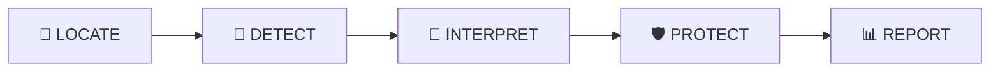
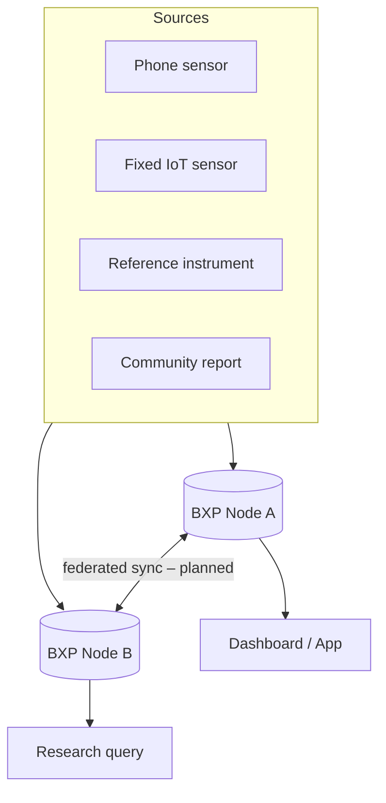

<p align="center">
  
</p>

<p align="center">
  <a href="LICENSE"></a>
  <a href="SPEC.md"></a>
  <a href="https://doi.org/10.5281/zenodo.18906812"></a>
  <a href="https://github.com/bxpprotocol/bxp-spec/actions"></a>
  <a href="https://github.com/bxpprotocol/bxp-spec"></a>
</p>

<p align="center">
  <b>BXP is to air quality data what HTTP is to the web</b> — a protocol, not a platform.<br>
  A common data language that any sensor, any agency, and any application can speak.<br>
  Owned by nobody. Usable by everyone. Free forever.
</p>

<p align="center">
  <a href="#the-problem">The Problem</a> ·
  <a href="#the-solution">The Solution</a> ·
  <a href="#quick-start">Quick Start</a> ·
  <a href="#architecture">Architecture</a> ·
  <a href="#bxp_hri--health-risk-index">Health Risk Index</a> ·
  <a href="#current-status">Status</a> ·
  <a href="#documentation">Docs</a>
</p>

---

## The Problem

Air pollution causes **7 million premature deaths annually** — more than HIV, malaria, and tuberculosis combined (WHO, 2021).

The sensors to measure it exist. The data infrastructure does not.

Every sensor manufacturer, government agency, and research network uses incompatible data formats. A sensor in Accra cannot feed a dashboard in Nairobi. A citizen reading in Delhi cannot contribute to a government pollution map. A researcher in London cannot query a database in Lagos using a single standard format.

**The barrier is not hardware. It is data fragmentation.**

## The Solution

| | |
|---|---|
| 📄 **`.bxp.json`** | A universal file format for atmospheric exposure data — one schema for any source, any location, any pollutant |
| 🩺 **BXP_HRI** | A composite Health Risk Index (0–100) derived from all available agents, weighted by WHO disease-burden data |
| 🌐 **REST API** | A standard set of endpoints any BXP node must implement, so any client can query any node |
| 🧪 **30+ atmospheric agents** | PM1, PM2.5, PM10, NO₂, O₃, CO, SO₂, benzene, formaldehyde, mold spores, heavy metals, and more — see [Appendix A](SPEC.md#appendix-a--complete-agent-reference) |
| 🔒 **Privacy framework** | SHA-256 hashed identifiers, geohash precision floors, k-anonymisation, cryptographic deletion |
| 🕸️ **Federated architecture** | No central owner — any organisation can run a BXP node on their own infrastructure |

## Repository Structure

```
bxp-protocol/
├── SPEC.md                          Protocol specification v2.0
├── CHANGELOG.md                     Development history
├── CONTRIBUTING.md                  Contribution guide
├── reference-server/
│   ├── server.py                    FastAPI reference node v2.1
│   ├── database.py                  SQLite persistence layer
│   ├── requirements.txt             Python dependencies
│   └── tests/                       Pytest suite
├── sdk/
│   ├── python/bxp_sdk.py            Python SDK v2.1
│   └── typescript/bxp-sdk.ts        TypeScript SDK
├── cli/bxp_cli.py                   Command-line tool v2.1
├── integrations/mqtt_bridge.py      MQTT → BXP bridge
├── datasets/sample_readings.bxp.json  10 global city readings
├── docs/
│   ├── api_documentation.md
│   ├── developer_guide.md
│   ├── protocol_overview.md
│   ├── index.html                   Landing page (GitHub Pages)
│   └── validator.html               BXP JSON validator & playground
├── postman/BXP_Protocol.postman_collection.json
├── assets/                          README/site imagery
├── Dockerfile
└── docker-compose.yml
```

## Quick Start

### Run the reference server

```bash
cd reference-server
pip install -r requirements.txt
python server.py
```

Server starts at **http://localhost:8000**
Interactive API docs: **http://localhost:8000/docs**
Dashboard: **http://localhost:8000/**

Optional: set `AQICN_TOKEN` for live global city data (free at https://aqicn.org/api/).

### Docker

```bash
docker-compose up
```

## Using the Python SDK

```python
from bxp_sdk import write_bxp, read_bxp, calculate_risk, BXPClient

# Calculate health risk from sensor values
risk = calculate_risk(pm25=67.0, no2=31.0, duration="24h", population="sensitive")
print(risk["score"])   # 89.6
print(risk["level"])   # VERY_HIGH

# Write a .bxp.json file
record = write_bxp("accra.bxp.json", {
    "latitude": 5.6037, "longitude": -0.1870,
    "pm25": 47.2, "no2": 18.3, "temp": 29.0
})
print(record["bxpHri"])       # 61.2
print(record["bxpHriLevel"])  # HIGH

# Read and verify
data = read_bxp("accra.bxp.json")
print(data["_integrityOk"])   # True

# Submit to a BXP node
client = BXPClient("http://localhost:8000")
result = client.submit(latitude=5.6037, longitude=-0.1870, pm25=47.2)
```

## Using the CLI

```bash
# Generate a .bxp.json file
python cli/bxp_cli.py generate --pm25 47.2 --no2 18.3 --lat 5.6037 --lon -0.1870

# Validate against BXP v2.0 spec
python cli/bxp_cli.py validate reading.bxp.json

# Calculate health risk
python cli/bxp_cli.py hri --pm25 67.0 --no2 31.0 --duration 8h --population sensitive

# Submit to a node
python cli/bxp_cli.py submit --server http://localhost:8000 --file reading.bxp.json

# Batch submit a directory of readings
python cli/bxp_cli.py batch-submit --dir ./sensor_data/

# Export as CSV
python cli/bxp_cli.py export reading.bxp.json --format csv

# Generate HTML map
python cli/bxp_cli.py map ./readings/ --output map.html
```

## API Examples

```bash
# Submit a reading
curl -X POST http://localhost:8000/bxp/v2/readings \
  -H "Content-Type: application/json" \
  -d '{"readings":[{"latitude":5.6037,"longitude":-0.1870,
       "agents":[{"agentId":"PM2_5","value":47.2,"unit":"ug/m3"}]}]}'

# Get latest for a location
curl http://localhost:8000/bxp/v2/locations/s1v0g/latest

# Get live city data
curl http://localhost:8000/bxp/v2/city/accra

# Server health
curl http://localhost:8000/bxp/v2/health
```

## Architecture

BXP uses a five-stage data pipeline:



| Stage | What Happens |
|-------|-------------|
| LOCATE | Geographic context attached (geohash, coordinates) |
| DETECT | Source classified (Tier 1 phone → Tier 3 reference instrument) |
| INTERPRET | QC applied, units normalised, quality flag assigned |
| PROTECT | BXP_HRI calculated, risk level and advice generated |
| REPORT | Stored, queryable, privacy-safe |



No node owns the network — any organisation runs its own, and clients can query across nodes using the same schema and API.

## BXP_HRI — Health Risk Index

A composite 0–100 score incorporating all available agents simultaneously, weighted by WHO disability-adjusted life year burden data:

| Score | Level | Guidance |
|-------|-------|----------|
| 0–20 | 🟢 CLEAN | No restrictions |
| 21–40 | 🟡 MODERATE | Sensitive groups: limit exertion |
| 41–60 | 🟠 ELEVATED | Reduce outdoor exertion |
| 61–75 | 🔴 HIGH | N95 outdoors, close windows |
| 76–90 | 🟣 VERY HIGH | Avoid outdoor activity |
| 91–100 | ⚫ HAZARDOUS | Health emergency |

## Current Status

| Component | Status |
|-----------|--------|
| BXP v2.0 specification | ✅ Complete |
| Reference server v2.1 | ✅ Complete |
| Python SDK v2.1 | ✅ Complete |
| TypeScript SDK | ✅ Complete |
| CLI tool v2.1 | ✅ Complete |
| MQTT bridge | ✅ Complete |
| Sample dataset | ✅ Complete |
| Binary `.bxp` format | 📄 Specified; implementation pending |
| Federated node sync | 📄 Specified; implementation pending |
| Arduino/ESP32 SDKs | 🗓️ Planned |

## Roadmap

**v2.1 (planned)**
- Python SDK pip package publication
- JavaScript/TypeScript npm package
- Arduino SDK
- ESP32 SDK
- BXP-STREAM real-time extension

**v3.0 (planned, 2027)**
- Waterborne contamination extension
- Soil contamination extension
- IoT mesh networking protocol
- BXP-HEALTH (HL7 FHIR R4 full mapping)

## Limitations

BXP is an independent research project at prototype stage:
- The binary `.bxp` file format is specified but not yet implemented in software
- The federated node synchronisation protocol is designed but not yet built
- No third-party has independently implemented the protocol
- BXP_HRI has not been clinically or epidemiologically validated
- The reference server is a prototype — not load-tested or security-audited in production

## Documentation

| Document | Location |
|----------|----------|
| Protocol specification | [`SPEC.md`](SPEC.md) |
| API reference | [`docs/api_documentation.md`](docs/api_documentation.md) |
| Developer guide | [`docs/developer_guide.md`](docs/developer_guide.md) |
| Protocol overview | [`docs/protocol_overview.md`](docs/protocol_overview.md) |
| Changelog | [`CHANGELOG.md`](CHANGELOG.md) |

## Contributing

BXP is open source under Apache 2.0. Contributions welcome.

See [`CONTRIBUTING.md`](CONTRIBUTING.md) for the RFC process. All specification changes require a 30-day public comment period via GitHub Issues.

GitHub: https://github.com/bxpprotocol/bxp-spec

## License

Apache 2.0 — Free to use, implement, modify, and distribute. No royalties. No restrictions. No gatekeepers.

## Citation

**Specification DOI:** https://doi.org/10.5281/zenodo.18906812
**Implementation DOI:** https://doi.org/10.5281/zenodo.18907003
**ORCID:** https://orcid.org/0009-0001-4856-4986

---

<p align="center"><i>The air is public. The data should be too.</i></p>
